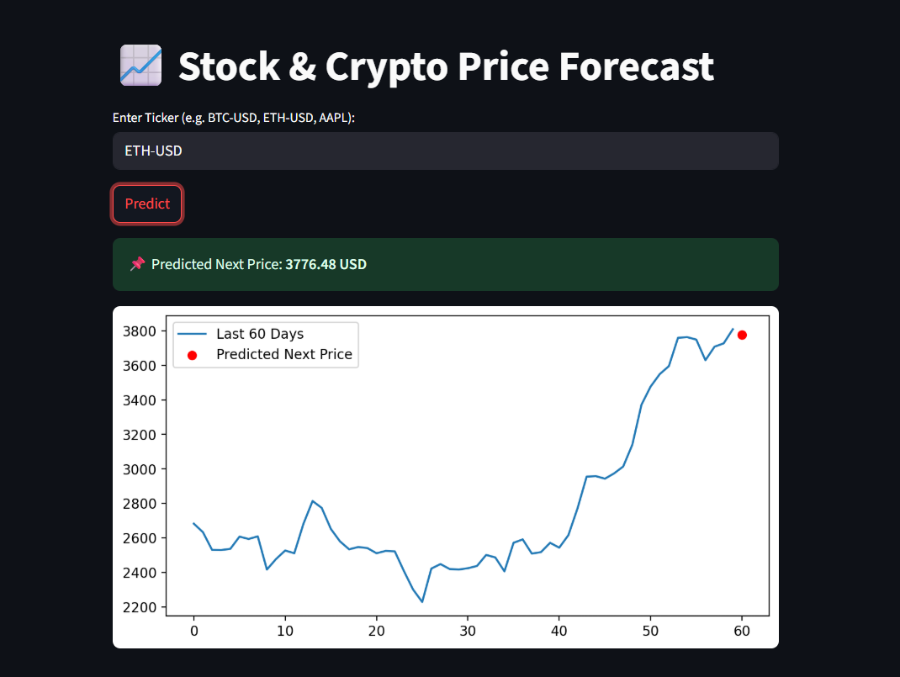
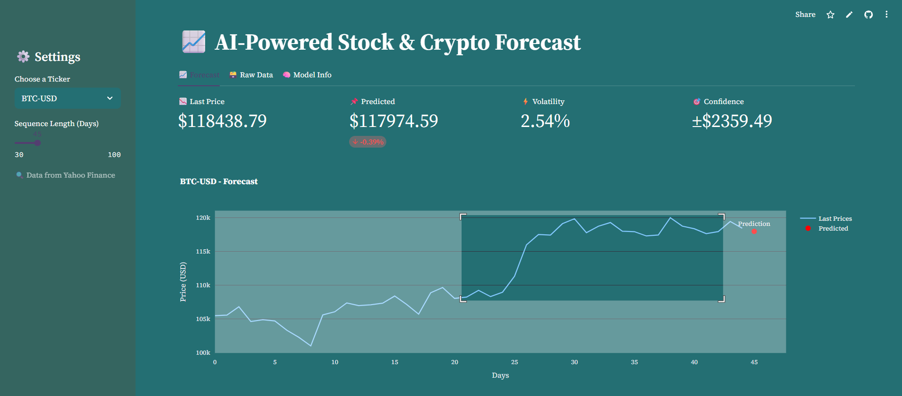
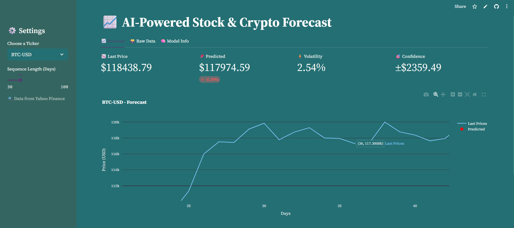

## 📈 Stock/Crypto Price Forecast with LSTM

An AI-powered forecasting app that predicts next-day prices for stocks and cryptocurrencies using an LSTM model trained on historical market data.

🌐 **Live Demo**: [https://mohsinnyz-stock-crypto-price-forecast.streamlit.app](https://mohsinnyz-stock-crypto-price-forecast.streamlit.app)  

🤗 **Hugging Face Model**: [mohsinnyz/stock-crypto-price-forecast](https://huggingface.co/mohsinnyz/stock-crypto-price-forecast)


---

## 📊 Key Features

### 🧠 LSTM Forecasting Engine
- Trained on 5 years of data from Yahoo Finance using a 2-layer LSTM.
- Predicts next-day closing price based on past 60 days (or user-adjustable).
- Outputs include predicted price, trend direction, volatility, and confidence.

### 📦 Ticker Selection
- Choose from popular options: `BTC-USD`, `ETH-USD`, `AAPL`, `TSLA`, `GOOGL`
- Or enter any custom ticker supported by Yahoo Finance

```python
option = st.selectbox("Choose a Ticker", ["BTC-USD", "ETH-USD", "AAPL", "GOOGL", "TSLA", "Custom"])
````

---

## 📐 Prediction Metrics

🔹 **Last Price** – Most recent closing value
🔹 **Predicted Price** – Model's next-day forecast
🔹 **% Change** – Growth or decline from last price
🔹 **Volatility** – Std dev of daily returns
🔹 **Confidence Range** – ±2% uncertainty band

```python
col1.metric("📉 Last Price", f"${last_price:.2f}")
col2.metric("📌 Predicted", f"${pred_price:.2f}", f"{percent_change:+.2f}%")
col3.metric("⚡ Volatility", f"{volatility:.2f}%")
col4.metric("🎯 Confidence", f"±${conf_range:.2f}")
```

---

## 🧾 Model Verdict

Automatically generated insight:

```python
if diff > 0:
    st.success("🔼 Model suggests an upward trend.")
elif diff < 0:
    st.warning("🔽 Model suggests a downward movement.")
else:
    st.info("➖ Model predicts stability in price.")
```

📌 Example verdict:

> 🔼 Model suggests an upward trend.

---

## 📈 Chart with Zoom & Prediction Marker

Interactive Plotly graph with:

* Zoom-in
* Last 60 days trendline
* Red dot for predicted price



---

---
## Interactive Forecast Chart Controls
The forecast graph is powered by Plotly, offering full interactivity directly in the browser:

Feature	Description
* 🔍 Zoom	Click and drag to select a specific region and zoom into it with scale control.
* 🔎 Zoom In / Out	Use the toolbar buttons to zoom step-by-step.
* ✋ Pan Mode	Move the entire graph in any direction by clicking and dragging.
* 📈 Autoscale	Instantly reset to the original zoom level.
* 📺 Fullscreen View	Expand the chart to full-screen mode for better analysis.
* 📷 Save as PNG	Export the current view of the graph as a high-quality .png file.

💡 These features help you deeply analyze market trends and predicted movements with just a few clicks — no code or setup required!
---

## 🗃️ Tabs

* 📈 **Forecast**: Visual + Metrics
* 🗃️ **Raw Data**: Last 100 rows
* 🧠 **Model Info**: Full model architecture

```python
tab1, tab2, tab3 = st.tabs(["📈 Forecast", "🗃️ Raw Data", "🧠 Model Info"])
```

---

## 🚀 How to Run Locally

```bash
# 1. Clone the repo
git clone https://huggingface.co/spaces/mohsinnyz/stock-crypto-price-forecast
cd stock-crypto-price-forecast

# 2. Create environment
pip install -r requirements.txt

# 3. Run Streamlit app
streamlit run app.py
```

---

## 📁 Folder Structure

```
.
├── app.py
├── requirements.txt
├── assets/
│   └── forecast.png
├── model_folder/
│   ├── BTC-USD_best_model.pth
│   └── config.json
├── README.md
```

---

## 📚 Tech Stack

* Python
* PyTorch
* LSTM
* Streamlit
* Hugging Face Hub
* yFinance
* Plotly

---

## ✨ Credit

Developed by [@mohsinnyz](https://huggingface.co/mohsinnyz)
Deployed via Streamlit Cloud

---


